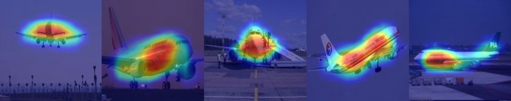

# DDT with PyTorch

Third-party PyTorch implementation of DDT(Unsupervised object discovery and co-localization by deep descriptor transformation) [1]. Please cite this paper if you use this code.

## Dependencies
- pytorch
- torchvision
- cv2

## Demo

```
python ddt.py
```

## Example



## References

[1]	X.-S. Wei, C.-L. Zhang, J. Wu, C. Shen, and Z.-H. Zhou, “Unsupervised object discovery and co-localization by deep descriptor transformation,” Pattern Recognition, vol. 88, pp. 113–126, Apr. 2019.